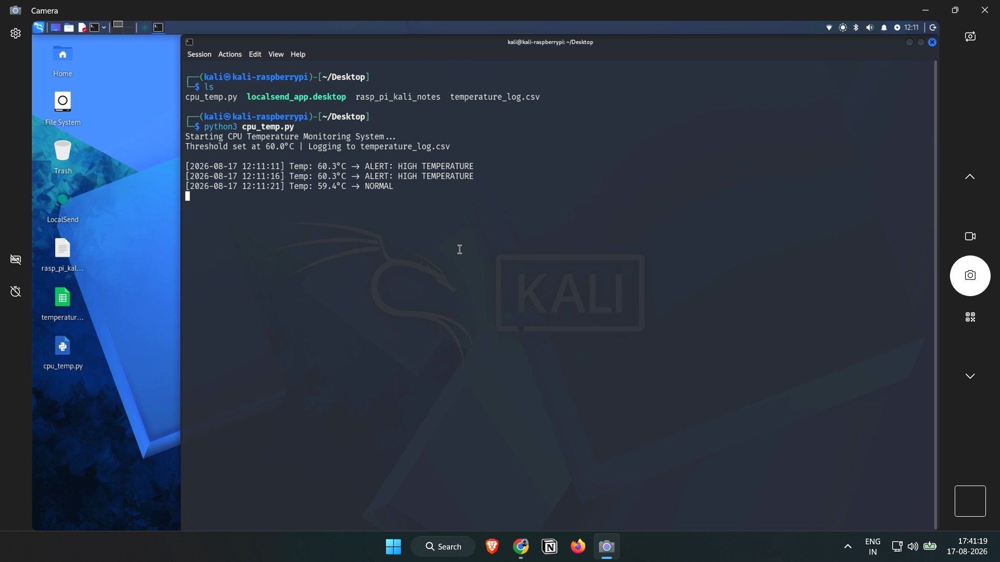

# Pi CPU Temperature Monitor

A real-time temperature monitoring system built on Raspberry Pi that reads CPU temperature at regular intervals, logs the data, and raises alerts when temperature crosses a safe threshold.

## Overview

This project simulates the core logic used in industrial monitoring systems — continuous sensing, threshold-based alerting, and data logging. It was built as a proof of concept using the Raspberry Pi's onboard CPU temperature sensor.

## Features

- Reads CPU temperature every 5 seconds using `vcgencmd`
- Logs each reading with a timestamp to `temperature_log.csv`
- Flags any reading above 60°C as an ALERT
- Runs continuously until manually stopped

## How It Works

1. `get_cpu_temperature()` runs the `vcgencmd measure_temp` command and extracts the temperature value
2. Each reading is timestamped and compared against a threshold (60°C)
3. Readings are printed to the terminal and appended to a CSV log
4. The loop runs every 5 seconds until interrupted (Ctrl+C)

## Tech Used

- Raspberry Pi 4
- Python 3
- `vcgencmd` (Raspberry Pi system tool)

## Sample Output

See `temperature_log.csv` for logged readings, and the screenshot below for a live terminal run.



## Future Scope

This project can be extended for real-world industrial use cases — for example, **tunnel air quality monitoring**, where the CPU sensor would be replaced with air quality sensors (CO, CO2, smoke) to detect unsafe conditions in tunnels and trigger real-time alerts, similar to systems used in metro/tunnel infrastructure monitoring.

## How to Run

```bash
python3 cpu_temp_monitor.py
```
